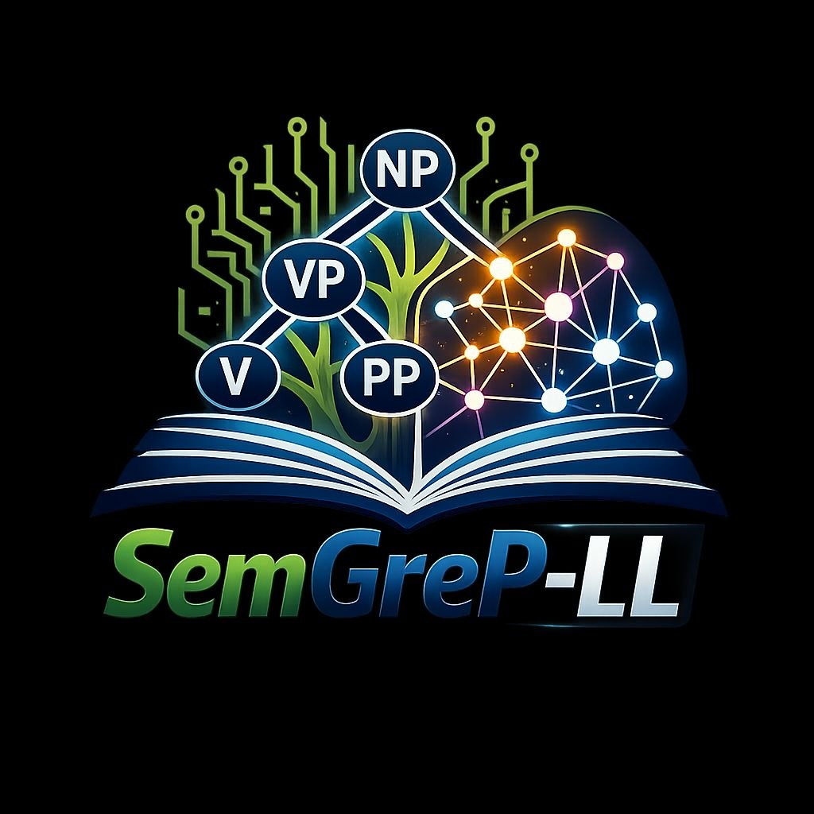

# semgrepll — Local Semantic Code Search

<p align="center">
  
</p>

<p align="center">
  <a href="https://pypi.org/project/semgrepll/">
    
  </a>
  <a href="https://github.com/rizperdana/semgrepll/blob/master/LICENSE">
    
  </a>
  <a href="https://github.com/rizperdana/semgrepll">
    
  </a>
</p>

100% offline semantic code search for AI coding agents.

## Features

- **Multi-backend**: llama.cpp → ONNX → Ollama (auto-detects fastest)
- **100% offline**: No external API calls
- **Hybrid storage**: SQLite (small) / LanceDB (large)
- **Embedding caching**: Fast re-indexing
- **Semantic search**: Find code by meaning, not keywords

## Installation

```bash
pip install semgrepll
```

## Quick Start

```bash
# Index a project
semgrep index ./my-project

# Search semantically
semgrep search "authentication logic"

# List indexed projects
semgrep ls
```

## Backends

| Rank | Backend | Speed |
|------|---------|-------|
| 1 | llama.cpp | ~1s |
| 2 | ONNX | ~3s |
| 3 | Ollama | ~6s |

## Environment Variables

| Variable | Default | Description |
|----------|---------|-------------|
| `EMBED_BACKEND` | auto | Backend: llama, onnx, ollama |
| `LLM_MODEL_PATH` | - | Path to GGUF model |
| `ONNX_MODEL_PATH` | auto | Path to ONNX model |
| `SEMGREP_BACKEND` | auto | Storage: sqlite, lance |

## For AI Agents

Install as a skill:
```bash
pip install semgrepll
```

See [semgrepll-skill](https://github.com/rizperdana/semgrepll-skill) for Claude Code, Cursor, OpenCode configs.

## License

MIT — see [LICENSE](LICENSE)
